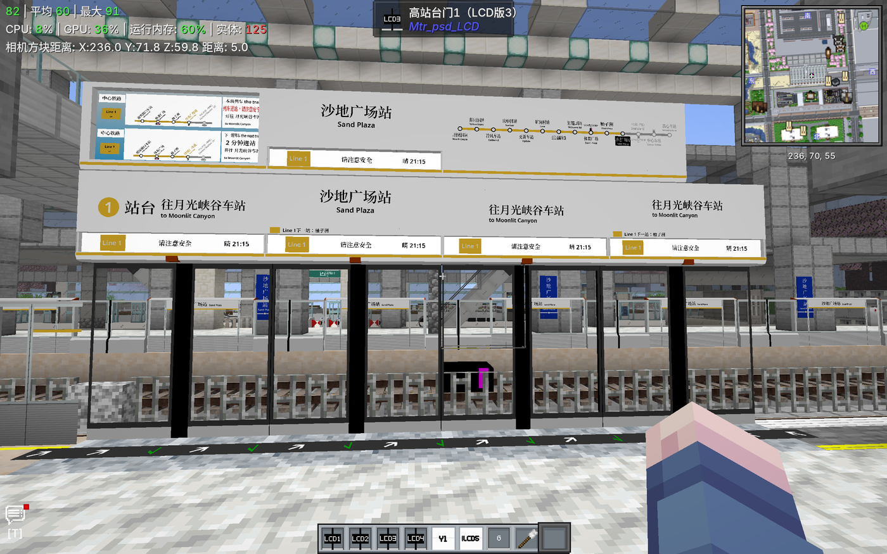

# Mtr_psd_LCD — Forge 1.20.1 / MTR 3 移植版



> **非官方移植**：本仓库是 **[Zzztick365/mtr_psd_lcd](https://github.com/Zzztick365/mtr_psd_lcd)** 的 fork。
> 原作版权归原作者 **Zzztick365** 所有，遵循 **MIT** 许可（原始版权行保留在 [LICENSE](LICENSE) 中）。
>
> **移植由 DeepSeek 完成，经 ChihayaAnonQWQ 实机测试未出现问题。**
> 如（后续）出现问题，**请勿提交给原仓库 / 原作者** —— 请在本仓库 Issues 反馈。
>
> 署名与分工见 [CREDITS.md](CREDITS.md)，移植技术细节与所有改动见 [PORT-REPORT.md](PORT-REPORT.md)。

---

## 📦 官方版本已发布（优先推荐）

原作者已在 Modrinth 发布官方构建：

> **`[MTR3] MTR-PSD-LCD 1.2.9`** —— **Forge 1.20.1 + MTR 3**（2026-10-06 发布）

该版本**已收录本移植的全部资源层修复**（干净贴图 `psd_top_clean` / `psd_top_edge_clean`、正面/背面 UV 方案、
门 blockstate 修复、`psd_top_lcd12` 还原等；经逐文件比对，模型与贴图与本移植**逐字节一致**），
Java 代码则由原作者沿用其自身实现。

👉 **推荐直接使用官方发布**：**[Modrinth 版本页 — mtr-psd-lcd/versions](https://modrinth.com/mod/mtr-psd-lcd/versions)**

本 fork 作为 **MTR 3 移植的开发与存档仓库**继续保留（含完整移植报告与实机验证记录）。

---

## 目录

- [这是什么](#这是什么)
- [与上游分支的关系](#与上游分支的关系)
- [运行环境](#运行环境)
- [安装](#安装)
- [构建](#构建)
- [与原版的差异](#与原版的差异)
  - [1. 屏蔽门 / 顶板材质与接缝线（重点）](#1-屏蔽门--顶板材质与接缝线重点)
  - [2. 屏蔽门类方块的模型烘焙（紫黑格修复）](#2-屏蔽门类方块的模型烘焙紫黑格修复)
  - [3. 原版信息顶板（`psd_top`）绘制门槛放宽](#3-原版信息顶板psd_top绘制门槛放宽)
  - [4. 凹槽屏线路图区间](#4-凹槽屏线路图区间)
  - [5. 工程侧新增](#5-工程侧新增)
- [常见问题](#常见问题)
- [下载](#下载)
- [反馈](#反馈)
- [署名](#署名)
- [许可](#许可)

---

## 这是什么

为 MTR（Minecraft Transit Railway）的**站台屏蔽门 / 半高安全门系统**提供 **LCD 信息显示**的附属模组：

| 显示内容 | 说明 |
| --- | --- |
| 本站名（中/英） | 顶板中央大字 + 英文小字 |
| 方向牌 / 目的地 | 「往 XXX」+ 目的地英文，带方向箭头 |
| 下一站 | `Line 1 下一站：柚子洲` 形式 |
| 线路图 | 局部区间（上一个站 + 本站 + 后 3 站）或整幅全线图 |
| 班次信息 | `本班列车 32 秒进站` / `下一班列车 2 分钟进站` |
| 安全提示 | `车门开启，请注意安全` / `车门关闭，请勿倚靠车门` |
| 时钟 / 天气 | 与班次信息轮播 |
| 自定义文字 / 图片 | 通过命令与资源包替换（原模组功能） |

方块类型：**信息顶板**（原版、LCD 1–22）、**高站台门**（LCD 版）、**高站台玻璃**（LCD 版）、**支柱 / LCD 方块**（装饰）。
LCD 顶板用**刷子**右键切换显示模式（方向牌 / 线路图 / 空白），换其他物品右键切换「是否常亮显示」。

---

## 与上游分支的关系

| | 上游 `main` | 本分支 `forge-1.20.1-mtr3` |
| --- | --- | --- |
| 加载器 | **Fabric**（fabric-loom 1.5.8） | **Forge 47.x** |
| Minecraft | 1.20.1 | 1.20.1 |
| MTR | **4.0.5** | **3.x**（`[1.20.1-3.2.2-hotfix-2, 1.20.1-4.0.0)`） |
| 代码基线 | 上游 `main`（`mod_version=1.2.0`） | 上游 **1.19.2 + MTR 3 的 v1.2.8** 发布版 |
| 产物 | `mtr-psd-lcd-*.jar`（Fabric） | `mtr_psd_lcd-forge-mc1.20.1-mtr3-1.2.8.jar` |

也就是说：上游 `main` 面向 **Fabric + MTR 4**；本分支把**同一模组的 1.19.2 + MTR 3 版本**移植到 **Forge 1.20.1 + MTR 3**，
服务于仍在用 MTR 3 的服务器与整合包。

---

## 运行环境

| 依赖 | 版本 |
| --- | --- |
| Minecraft | **1.20.1** |
| Forge | **47.x**（开发 47.4.0，实机验证 **47.4.15**） |
| MTR（Minecraft Transit Railway） | **3.x 的 Forge 构建**，区间 `[1.20.1-3.2.2-hotfix-2, 1.20.1-4.0.0)`（实机 **3.6.3**） |
| Architectury API | **9.2.14+**（MTR 3 Forge 构建的强制依赖） |
| Java | 17 或 21（产物为 Java 17 字节码） |

> ⚠️ **不能与官方 MTR 4 版本共存**：两者的 `mod id` 都是 `mtr_psd_lcd`，同时放进 `mods/` 会在启动时报错。
> 使用 MTR 4（官方 `forge1.20.1+1.2.7`）时请用官方版本，本分支面向 **MTR 3**。

---

## 安装

1. 安装 **Forge 1.20.1（47.x）**；
2. 在 `mods/` 放入：
   - **MTR 3** 的 Forge 构建（3.2.2-hotfix-2 ~ 3.x，实机 3.6.3）
   - **Architectury API 9.2.14+**
   - 本模组 `mtr_psd_lcd-forge-mc1.20.1-mtr3-1.2.8.jar`
3. 启动后，在 MTR 的仪表板里建好线路与站台，然后：
   - 把**信息顶板**放在屏蔽门上方（或任意位置，见下方说明）；
   - 用**刷子**右键切换显示内容，用其它物品右键切换常亮模式。

---

## 构建

```bash
# JDK 17 / 21 均可
./gradlew clean build            # Windows: gradlew.bat clean build
# 产物：build/libs/mtr_psd_lcd-forge-mc1.20.1-mtr3-1.2.8.jar
```

开发环境运行（需本地准备 MTR / Architectury 依赖）：

```bash
./gradlew runClient -PmtrRuntimeTest
```

打包前建议先跑模型校验脚本（本移植已被它拦下过多次实机故障）：

```bash
python tools/validate_models.py [MTR jar 路径]
```

它会检查：blockstate→模型是否能沿 `parent` 链解析、每个面是否都有 `texture`、`#变量` 是否有定义、
`from/to` 是否为 3 个数、**`uv` 是否恰好 4 个数**、每个贴图文件是否真实存在，并附一份与上游 jar 的差异清单。

### 诊断开关

| 开关 | 作用 |
| --- | --- |
| `-Dmtrpsdlcd.debug=true` | 输出详细日志（开发环境默认开启） |
| `-Dmtrpsdlcd.dumpmaps=true` | 把生成的线路图 / 面板贴图导出到 `<gamedir>/psd-debug/*.png` |

---

## 与原版的差异

除「Fabric → Forge」这一根本性差异外，本移植还有以下**有意改动**（每项的原因与验证过程都在 [PORT-REPORT.md](PORT-REPORT.md)）：

### 1. 屏蔽门 / 顶板材质与接缝线（重点）

**问题**：MTR 自带的顶板贴图里**本身就画着接缝线**：

| 贴图 | 内容（64×64） |
| --- | --- |
| `mtr:block/psd_top.png` | 白色 4032 px + **灰色 64 px（一整行横线）** |
| `mtr:block/psd_top_edge.png` | 白色 3969 px + **灰色 127 px（一条横线 + 一条竖线）** |

原版顶板模型各面把贴图整幅铺开（例如 `[0,5.12,8]→[6,16,16]` 的 `east` 面 `uv:[0,0,16,15]`），
于是那两行灰线正好落在面板中部：**横线横穿站名文字、竖线落在方块交界处**，视觉上很突兀。

**改法**（只在自身命名空间内解决，**MTR 的资源零改动**）：

1. 新增两张干净贴图：`mtr_psd_lcd:block/psd_top_clean.png`、`mtr_psd_lcd:block/psd_top_edge_clean.png`
   （把灰线像素涂白，其余不变）；
2. **只有「正面」（`east`，即文字/LCD 所在的那一面）**改用干净贴图；
3. **背面（`west`）照抄 MTR 原模型的 UV 手法**，让面板背面**只保留一条**接缝线，并与 MTR 顶板**同高**：
   - 线在贴图第 29 行（UV `v≈7.25`）；MTR 主体板 `uv:[16,0,0,15]` 使线落在 **y=8.75**（方块高度的 54.7%）；
   - 本移植让**所有纵向跨过 y=8.75 的背面分区**都按该高度画线，其余分区映射到无线条的白色条（`uv:[16,15,u,16]`）→ 线**连续且唯一**；
   - 同时避开 `psd_top_edge` 贴图 `u=0` 处的竖线（u 端点用 0.5），避免分区边界冒出竖线；
4. **其它面**（上/下/侧面、端面）保持 MTR 原样。

受影响的模型（其余模型与上游**逐字节一致**）：

```
psd_top_left_base / psd_top_right_base / psd_top_left_persistent_base / psd_top_right_persistent_base
psd_top_left_edge / psd_top_right_edge / psd_top_left_2 / psd_top_left_3 / psd_top_right_2 / psd_top_right_3
psd_top_left_end / psd_top_right_end
psd_top_lcd14_groove_left_base / psd_top_lcd14_groove_left_edge_base
psd_top_lcd14_groove_right_base / psd_top_lcd14_groove_right_edge_base
psd_top_box_full_2
（新增）psd_top_left_base_clean / psd_top_right_base_clean —— 供直接继承 MTR 基础模型的少数状态使用
```

> 副作用：若某资源包重绘 `mtr:block/psd_top*`，本模组顶板的**正面**不再跟随（其余面仍跟随）。

### 2. 屏蔽门类方块的模型烘焙（紫黑格修复）

原版的 10 个门 blockstate 全部分支都带 `temp` 属性，而 1.20.1 的 MTR 门只注册
`end / facing / half / side / unlocked`，导致 **640 次「模型烘焙失败」**并显示紫黑格。
本移植把这 10 个 blockstate 改为 `{"variants":{"":{"model":"minecraft:block/air"}}}`（与 MTR 一致），
门体继续由 MTR 的 BER 绘制。修复后开发客户端日志中
`Unable to bake model` / `Unknown property` / `Exception evaluating model definition` 全部为 **0**。

### 3. 原版信息顶板（`psd_top`）绘制门槛放宽

上游渲染器只在**正下方是屏蔽门/玻璃**时才绘制顶板内容（`RenderPSDTop.renderAdditional` 里的
`currentBlockBelow instanceof BlockPSDAPGDoorBase || standaloneModule`）。
本移植对**原版信息顶板**放宽为"只要能取到站台数据就绘制"，与 MTR 原版顶板行为一致；其它 LCD 型号行为不变。

### 4. 凹槽屏线路图区间

保持**官方行为**：**上一个站 + 本站 + 后 3 站**（起点站 `0…3`、终点站 `n-3…n-1`、其余 `currentIndex-1 … currentIndex+3`）。
需要整条线路时请使用：

- `lcd12` —— 整幅玻璃线路图；
- `lcd13` —— 每线路一张完整线路图。

### 5. 工程侧新增

- `tools/validate_models.py`：构建前模型校验（见[构建](#构建)）；
- 诊断开关 `-Dmtrpsdlcd.debug` / `-Dmtrpsdlcd.dumpmaps`；
- `PORT-REPORT.md`：完整移植报告（映射方案、工具链、每处改动与验证证据）。

---

## 常见问题

| 现象 | 说明 |
| --- | --- |
| 刚放下的顶板**空白 / 不显示内容** | 顶板需要"平台数据"：确认该处属于 MTR 站台，并用**刷子**右键切换显示模式；原版信息顶板已放宽为无需正下方是门/玻璃 |
| 放下的方块显示**紫黑格** | 说明模型加载失败（多见于资源包覆盖或版本不匹配）。本移植已修复原版的该问题；若仍出现请附 `logs/latest.log` 反馈 |
| 与 **MTR 4** 一起装就报错 | 两者 `mod id` 相同，**不可共存**，请二选一 |
| 顶板背面有一条横线 | 这是**有意保留**的接缝线（与 MTR 顶板同高 `y=8.75`），正面已无横线/竖线 |
| 线路图只显示几站 | 官方设计如此（上一个站 + 本站 + 后 3 站）；要全线请用 `lcd12` / `lcd13` |

---

## 下载

| 来源 | 说明 |
| --- | --- |
| **[Modrinth（官方，推荐）](https://modrinth.com/mod/mtr-psd-lcd/versions)** | 原作者发布，`[MTR3] 1.2.9` = **Forge 1.20.1 + MTR 3**，已收录本移植的资源层修复 |
| [本仓库 Releases](https://github.com/ChihayaAnonQWQ/mtr_psd_lcd/releases) | 本移植的构建（MTR 3 维护分支，资源层与官方 1.2.9 一致） |

也可以按上面的步骤自行构建。

---

## 反馈

- 本项目**不是**官方发布：**如出现问题请勿提交给原仓库 / 原作者**；
- 请在本仓库的 [Issues](https://github.com/ChihayaAnonQWQ/mtr_psd_lcd/issues) 反馈（附 `logs/latest.log` 与截图更快定位）。

---

## 署名

| 角色 | 署名 | 说明 |
| --- | --- | --- |
| **原作作者** | **Zzztick365** | 模组《Mtr_psd_LCD》的作者（上游 `main`：Fabric 1.20.1 + MTR 4.0.5） |
| 上游贡献者 | **hermes** | 原发布版 `fabric.mod.json` 中列出的 contributors |
| **移植（Forge 1.20.1 + MTR 3）** | **DeepSeek** | 反编译→映射→重写加载器/注册/渲染层、编写校验与打包脚本、逐项定位并修复实机问题 |
| **实机测试 / 仓库与发布维护** | **[ChihayaAnonQWQ](https://github.com/ChihayaAnonQWQ)** | 整合包内实机测试（测试期间未发现问题）、维护本仓库与 Release |

**移植由 DeepSeek 完成，经 ChihayaAnonQWQ 实机测试未出现问题。如出现问题请勿提交给原仓库 / 原作者。**

---

## 许可

**MIT** —— [LICENSE](LICENSE) 为上游原始 MIT 文本（`Copyright (c) 2026 psd_only contributors`），**未做改动**；
本移植的声明、基线说明与反馈渠道见 [NOTICE.md](NOTICE.md)。重新分发时请一并保留署名信息。
